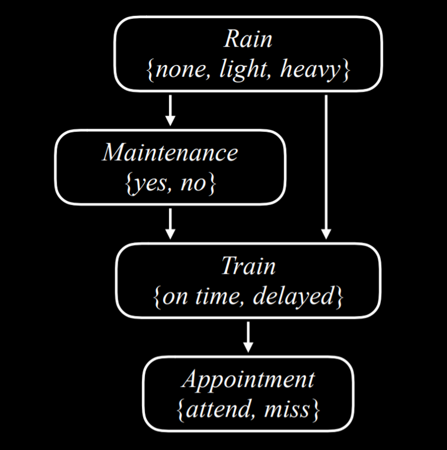

## This week covers how artificial intelligence deals with uncertainty and probabilities. 

1) Axioms of Probability 
    * 0 < P < 1
    * Sum(P(omega) = 1)
    * Random Variable: some x, that can take some set of values {a, b, c} in probabilistic manner. 
    * Unconditional probability: % chance in absence of any other evidence
    * Conditional probaility: % chance given some evidence b

        $$ P(a \mid b) = \frac{P(a \cap b)}{P(b)} $$
    * Independence: a,b are independent if 
        $$ P(a \cap b) = P(a)P(b) $$

2) Bayes Rule 
  Given $ P(a \mid b) $ we can calculate $ P(b \mid a) $

$$
P(b \mid a) = \frac{P(b) P(a \mid b)}{P(a)}
$$

3) Joint Probability 

    Single variable tables: 

    | R = rain | ~R = ~rain|    
    |----------|-----------| 
    | 0.1      | 0.9       |
    
    | C = cloud | ~C = ~cloud |    
    |----------|-----------| 
    | 0.4      | 0.6       |

    Joint Table where we see how each event correlates with another event. 

    | C \ R   | R  | ~R |
    |---------|----------|-----------|
    | C   | 0.08     | 0.32      |
    | ~C   | 0.02     | 0.58      |

    note: sum of probabilities need normalization to find correct couccurance 

4) Probability Rules 
    
    | Inference Rule                | Mathematical Expression                     | Description |
    |-------------------------------|---------------------------------------------|-------------|
    | Negation                      | $P(\neg a) = 1 - P(a)$                     | $P(\neg a)$ is calculated as $1 - P(a)$, considering all possible worlds add up to $1$. |
    | Inclusion-Exclusion           | $P(a \lor b) = P(a) + P(b) - P(a \land b)$  | Probabilities of $(a \lor b)$ is calculated by summing $P(a)$ and $P(b)$ and subtracting the overlap $P(a \land b)$. This avoids double-counting the cases where both $a$ and $b$ are true. |
    | Marginalization               | $P(a) = P(a, b) + P(a, \neg b)$             | When considering $a$ and $b$ as disjoint probabilities, $P(a)$ can be obtained by adding $P(a, b)$ and $P(a, \neg b)$. |
    | Conditioning                  | $` P(a) = P(a \mid b)P(b) + P(a \mid \neg b)P(\neg b) `$ | The probability of $a$ occurring is computed as the sum of conditional probabilities given $b$ and $\neg b$. |

5) Bayesian Networks

    Bayesian network is a data structure that represents the dependencies among random variables
    * directed graphs
    * Each node on the graph represents a random variable.
    * An arrow from X to Y represents that X is a parent of Y. That is, the probability distribution of Y depends on the value of X.
    * Each node X has probability distribution $ P(X | Parents(X)) $

6) Inference 
    * Query X: variable for which we want P distribution
    * Evidence var E: variables for event e, that have already been observed
    * Hidden var: variables that we can't observe
    * The goal: calculate P(X|e)
    
    Inference by Enumeration: 
    $$
    P(X | e) = \alpha P(X, e) = \alpha \sum_{y} P(X, e, y)
    $$
    note: this is extremely inefficient as number of variables grows. suppose we have 30 variables with 2 states, we will need $2^{30}$ multiplications to arrive at the exact probability.

7) Sampling 

    Generates n Number of samples based on individual P distributions, discards samples that don't match the evidence.
    then calculating how many times our desired outcome happened out of all the generated outcomes.  

    note: can be made more efficient by fixing evidence variables. 

8) Markov Models 
    
    All markov models are built on markov assumption, that current state depends on finite amount of previous states. 

    There is also Sensor Markov Assumption, which says that hidden state is based only on observable things.

    given observation from start to end, it's useful for: 
    * Filtering: Generate P of it raining today
    * Prediction: P of it raining for a future state
    * Smoothing: P of previous events
    * Most likely explanation: most likely sequence of events

