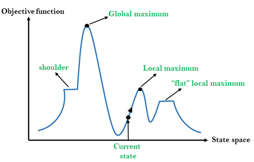

## This week covers how artificial intelligence deals with not only finding a solution to a problem, but also finding optimal solutions. 

often, exploring the entire state-space is unfeasible, thus we need to make trade offs on resource usage and finding pursuing better solution. 

The hill climbing algorithm exemplifies this approach by simplifying the problem to a more manageable number of dimensions, often visualized as a two-dimensional state space. This simplification allows us to graphically represent our current position and evaluate our progress towards the peak, as depicted in the accompanying illustration. 

some definitions: 
* Objective Function
* Cost Function 
* Current/Neighbor States
* Local Search

### 1) Hill Climbing: 

This is the type of local search where neighbor states and the current state are compared and the agent moves to the best option. It has a few limitations, namely getting stuck on local maxima/minimas.  

The graph highlights various outcomes, such as reaching a local maximum or the global maximum, which represent different levels of solution optimality within the state space.

There are 5 main versions of hill climbing: 
* Steepest Ascent: (standard) simply chooses the highest-valued neighbor
* Stochastic: randomly chooses from highest-valued neighbors
* first-choise: chooses from the 1st highest neighbor
* rand-restart: restarts hill climbing from random locations after reaching it's end
* local Beam Search: uses multiple nodes in parallel for search  

Another wrinkle that can be added is Simulated Annealing: 

Solves the problem by introducing "temparature variable", which is high at the start and slowly decreases. This stochastic element mimics the physical process of annealing in metallurgy. The temperature governs the likelihood of the algorithm accepting suboptimal moves, thereby granting it the flexibility to escape local maxima and explore a broader swath of the state space. As the algorithm progresses and the temperature cools, its exploration becomes more focused, ultimately converging on a solution.
 
### 2) NP Complete Problems:

In essence:
 P = Set of problems solvable in polynomial time 
 NP = Set of problems verifiable in polynomial time
 NP Complete:
* It is in NP
* Every problem in NP can be reduced to it in polynomial time.
    
if you find a way to solve one of these then, N = NP can be proven, so you can solve the rest as well. issue is no one knowns if there is a fast method yet. 

An example of NP Complete Problems is Travelling Salesman problem: 

it's a classic example of an NP-Complete problem where the challenge is to find the shortest possible route that visits a set of cities and returns to the origin city, without visiting any city more than once. Despite its simplicity, no efficient solution is known for the TSP, making it a prototypical NP-Complete problem that is used to study computational complexity and optimization.

Since there are no known efficient and exact solutions to these problems, we can use approximations to get a "good enough" answer, using hill climbing variations. 

### 3) Linear Programming: 

Seeks to optimize some linear Equation $ y = ax_1 + bx_2... $
* cost function: value obtained by $ ax_1 + bx_2... $
* constraint: sum of variables limitation $ ax_1 + bx_2 ≤ C $
* Individual bounds: $ min ≤ x_1 ≤ max $

example: 

     objective function: $ 50x_1 + 80x_2 $
     Constraint 1: $ 50x_1 + 2x_2 ≤ 80 $
     Constraint 2: $ -10x_1 - 12x_2 ≤ -90 $

### 4) Constraint Satisfaction:

has following properties:
* Set of variables: ($x_1,x_2... x_n$)
* Set of domains for each variable: ($D_1,D_2... D_n$)
* Set of Constraints $ C $

Constraint types: 
* Hard Constraint: MUST be satisfied
* Soft Constraint: Preferred solution
* Unary Constraint: Involves a single variable, e.g., ex, {$ A ≠ Red $}
* Binary Constraint: Involves a pair of variables, e.g., {$ A ≠ B $}

 Node Consistency: A state where all unary constraints are satisfied for every variable.
 Arc Consistency: A state where all binary constraints are satisfied for every variable.
    
example, arc consistency of X towards Y:
* remove elements from the domain of X until all choices for X allow for choice in Y 

BackTracking Search: 
    
 This algorithm applies node and arc consistency iteratively. If a variable assignment violates a constraint, the algorithm backtracks to a previous assignment and tries a different path. It continues until a solution is found or all options are exhausted. 

Additionally, for efficiency there are multiple heuristics: 

| Heuristic Name   | Function  | Reasoning |
|---------|----------|-----------|
| MRV (Minimum Remaining Values)   |  Select state for a Node with fewest legal values left  | Fewer options at the start lead to dead-end or success more quickly |
| Degree Heuristic   |  Select Node with most connections to other arcs  |  constrain a lot of other nodes, which lowers number of potential permutations |
| LCV (Least Constraining Values)   | Select value within the Node that contains least values within other nodes    | less likelyhood of backtracking  |
    