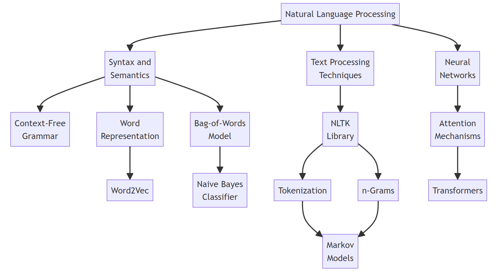

## This week starts dealing with Natural Language Processing, more specifically topics such as context free grammar and Tranformer models. 

<div align="center">

</div>


Syntax and Semantics: 
* Syntax: Sentence Structure in Gramatical Sense
* Semantics: Meaning of words 
Text Processing Techniques: 

### 1) Syntax and Semantics 
#### (1) Context-Free Grammar
Abstracting sentence meaning in favor of representing it as it's formal Grammar Structure, for sentence "She saw the city" would be for example:

```ascii
      S
     / \
    ↙︎   ↘︎
   NP    VP
   ↓     ↙︎ ↘︎
   N    V    NP
   |    |    ↙︎ ↘︎
   |    |    D   N
   ↓    ↓    ↓    ↓ 
  she  saw  the  city
```

#### (2) Word Representation
Dealing with how words can be numerically represented: 

for example, in sentence "Trust The Process", each word can be represented as an unique vector where placement of 1 within that array os 0s signifies which word it represents. 
##### 1. One hot representation 
```
Trust [1,0,0]
The [0,1,0]
Process [0,0,1]
```
this however, is not very efficient as for 50000 words, we would effectively be wasting 49999 0s within the array in order to represent a word. Thus, Distributed Representation works best for large dictionaries.

##### 2. Distributed Representation 
```
Trust [-0.5,0,0.5]
The [0,0.2,0]
Process [0.3,0.3,0.9]
```
where we can give each word it's own unqiue vector. 

Taking this a step further, we end up at 
* Word2Vec: Using Distributed Representation, every word end up being a vector in the word vector space where proximity is determined by how close the words are to each other. 

#### (3) Bag-Of-Words Model
unlike Context-Free Grammar, this approach disregards syntax for semantics. it's useful for classification tasks such as: 
* Sentiment analysis with Naive Bayes 
      * based on probability table of each word being Positive/Negative in meaning, calculates probability that sentene is positive or negative. 

### 2) Text Processing Methodologies

Tokenization: 
* Method for breaking text down into smaller units called "tokens", usually there is a mapping between which letter/word/sentence corresponds to which numerical value. 

n-grams: 
* grouping of "n" continous tokens, for the sake of analysis within a batch

Markov Models: 
* using markov models it's possible to predict what the token in the place of a  masked token should be. 

### 3) Neural Networks

In the context of NLP, The process of taking an input, processing it through multiple layers, and outputting a result is more complex. It involves translating input sequences (like sentences) into output sequences, which can be challenging due to the variable lengths of input and output sequences. Recurrent Neural Networks are especially useful for this task. 

#### (1) Recurrent Neural Networks: 

* In an RNN, inputs are processed in a sequence, with each step's output depending on the previous steps. This sequential processing makes RNNs suitable for tasks like machine translation and chatbots, where understanding the context and sequence of words is crucial.

* However, RNNs face challenges, particularly with long sequences. When processing a long piece of text, the RNN must store all previous information in its hidden state, which can be difficult and lead to issues like vanishing gradients.

#### (2) Attention Mechanism: 

* To address some of the limitations of RNNs, the attention mechanism was introduced. It allows the neural network to focus on specific parts of the input sequence when generating each word of the output sequence. For instance, in a sentence like "What is the capital of Massachusetts", the attention mechanism helps the network focus on relevant words like "capital" and "Massachusetts" when needed. This mechanism enhances the ability of the network to handle long sequences and maintain context.

#### (3) Transformers: 

* Transformers represent a significant advancement in NLP. Unlike RNNs, which process sequences step-by-step, transformers process all words in a sequence simultaneously, enabling parallel processing and significantly faster training times.

In a transformer architecture:

1) Input Processing: Each input word is passed through the neural network simultaneously, with position encoding added to maintain the order of words.

2) Self-Attention: This step allows the network to weigh the importance of different words in a sequence relative to each other, providing a richer understanding of context.

3) Encoding and Decoding: The encoder captures the context of each word in the sequence, while the decoder generates the output sequence, using both the encoded inputs and its previous outputs.
Transformers have revolutionized NLP, leading to the development of large language models that can handle complex tasks with greater efficiency and accuracy than was previously possible.


